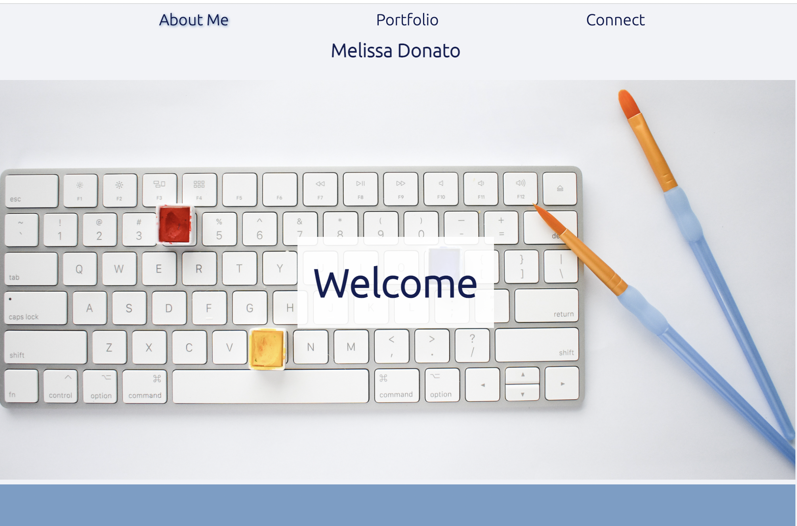
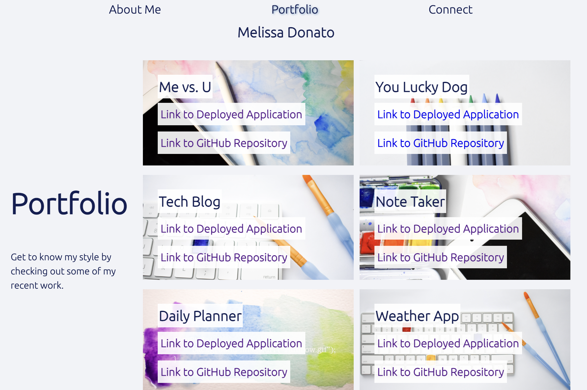
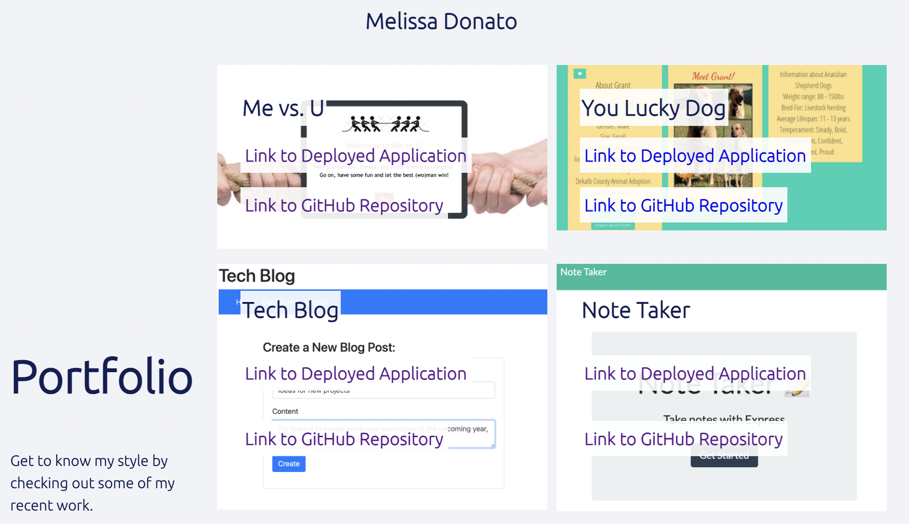
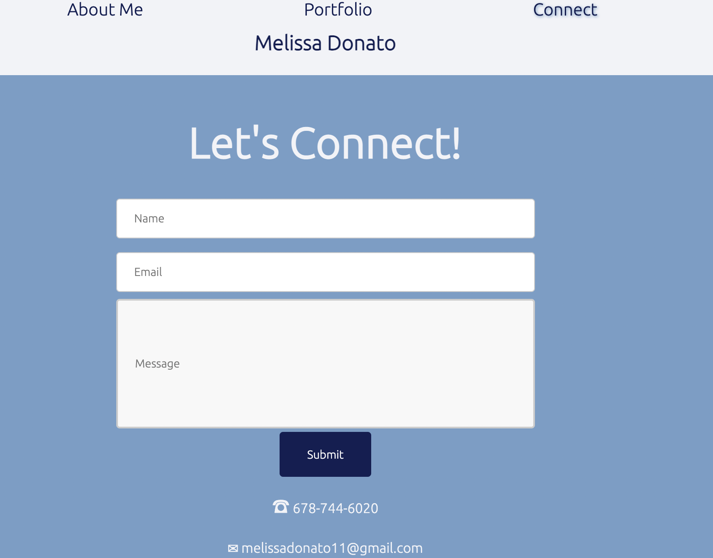

# MyPortfolioWithReact


## Description
 💡 The purpose of this project is to create a space to showcase future work and also tell a little about myself (the author) so that friends, family, prospective employers/clients, or collaborators can get a feel for my web developer experience.  Not only does this portfolio page display examples of my work, but the page itself also demonstrates my coding ability.

✨ This Portfolio Page 2.0 is an update from my original page using new technologies, including React.  I plan to continue to update this page with new projects to showcase and modify the code with new technologies as I continue to hone my skills.

## Table of Contents
- [User Story](#user-story)
- [Usage](#usage)
- [License](#license)
- [Contributing](#contributing)
- [Tests](#tests)
- [Deployed Application](#deployed-application)
- [Questions](#questions)

## User-Story

```md
AS AN employer looking for candidates with experience building single-page applications
I WANT to view a potential employee's deployed React portfolio of work samples
SO THAT I can assess whether they're a good candidate for an open position
```


## Usage
When users first view the page, they are directed to the Welcome splash page and About Me section.



I've used React to conditionally render different pages based on the navigation link selected by the user.  Notice, the links are highlighted based on the page the user is viewing. 


I've also updated the project images to show specific screenshots of the corresponding projects whenever a user hovers over the project section.


Users can submit contact information on the Connect page, which includes basic validation to ensure all fields are populated and emails are valid.


## License
This application is covered under the [License: MIT](https://opensource.org/licenses/MIT).


## Contributing
Resources from this project:
- Node.js
- React
- Deployed on GitHub Pages


## Tests
No test scripts for this application.


## Deployed Application
[Checkout the live application]()

## Questions
Contact Details:

- GitHub profile: [mel-ificent](https://github.com/mel-ificent)
- For additional questions, you can contact me via email: melissadonato11@gmail.com